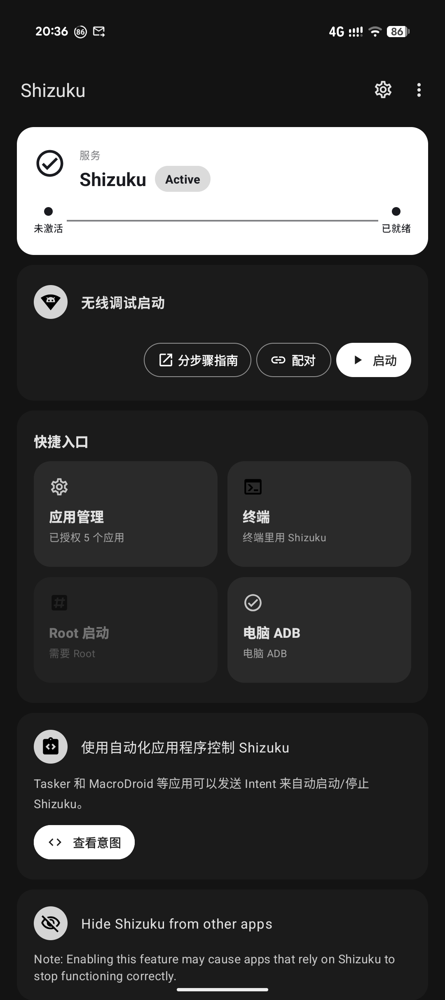

# OneIms 📱✨

> **让 Pixel 和运营商重新学会沟通。**
> 一个面向 Google Pixel 的 IMS 配置、诊断与修复助手。
> 不靠玄学，不靠反复刷机——只想把藏起来的能力，放回它该待的位置。

---

<div align="center">

**VoLTE · VoWiFi · VoNR · OneKuku · 国家码 · IMS 诊断 · CarrierConfig · Android 16/17**

📱 [Telegram · OneBoardX](https://t.me/OneBoardX)

<br/>

### ⬇️ 下载 APK（最新 · v3.0.8 · 请自选产品线）

> **两个包功能相同（IMS/诊断/恢复），差别只在「特权通道怎么激活」——看下方选购指南，**只装其中一个**即可；进阶用户也可同机并存对比。

| 推荐给… | 包 | 下载 |
|---|---|---|
| 🟢 **想少装 App、App 内一键配对** | **OneKuku（独立激活）** | [OneIms-OneKuku-standalone-3.0.8.apk](https://github.com/asrtroh-netizen/OneIms/releases/download/v3.0.8/OneIms-OneKuku-standalone-3.0.8.apk) |
| 🔵 **已有 / 想用 Shizuku 轻壳** | **OneIms Lite（Shizuku）** | [OneIms-Lite-Shizuku-3.0.8.apk](https://github.com/asrtroh-netizen/OneIms/releases/download/v3.0.8/OneIms-Lite-Shizuku-3.0.8.apk) |

[📦 全部 Release 资产](https://github.com/asrtroh-netizen/OneIms/releases/tag/v3.0.8)

> 💙 **友情推荐特权通道**：[asrtroh 修缮版 Shizuku V15.0](https://github.com/asrtroh-netizen/shizuku)（配对一次 · 旧 Wi‑Fi 自连 · 开机 FGS 内激活）  
> 下载正式包：[Releases](https://github.com/asrtroh-netizen/shizuku/releases) · 截图：
>
> 
>
> 装 **OneIms Lite** 时优先用这只；装完请关掉电池优化，保持首页 **Active**。上游能力仍归 [RikkaApps/Shizuku](https://github.com/RikkaApps/Shizuku)。

> 本仓库 **只提供 README + APK 发布**，**不开放源代码**。  
> 需要交流 / 反馈请走 Telegram，别来仓库里翻源码啦～

</div>

---

## 🧭 怎么选？OneKuku vs OneLink（2.2.1 起）

两个 APK **业务功能一致**（VoLTE/VoWiFi/诊断/恢复/独家功能），区别只在 **特权通道** 怎么获得：

| | **OneKuku（独立激活）** | **OneIms Lite（Shizuku）** |
|---|---|---|
| **适合谁** | 不想另外装 Shizuku；希望 **App 内无线调试 + 通知栏填码** 一条龙 | 已熟悉 Shizuku；想要 **更小安装包、更轻壳** |
| **包名** | `com.oneims.app` | `com.oneims.onelink` |
| **激活方式** | 内嵌 OneBridge · 无线调试配对 · 可通知栏六位码 | **推荐搭配** [asrtroh 修缮版 Shizuku](https://github.com/asrtroh-netizen/shizuku)（开机自启更稳）；也可使用官方 [RikkaApps/Shizuku](https://shizuku.rikka.app/) |
| **额外依赖** | 无（通道打进包内） | 需安装 Shizuku；日常保持 **Active** 即可 |
| **体积** | 较大（含内嵌 ADB/Bridge） | 较小 |
| **同机并存** | ✅ 可与 OneIms Lite 同时安装 | ✅ 可与 OneKuku 同时安装 |

**怎么选（一句话）：**

* 你是 **「我只想在一个 App 里搞定」** → 下 **OneKuku（独立激活）**
* 你是 **「我手机本来就有 / 想用 Shizuku」** → 下 **OneIms Lite** + **[asrtroh Shizuku V15.0](https://github.com/asrtroh-netizen/shizuku/releases)**（友情推荐）
* 不确定 → 先试 **OneKuku**；若你本来就在用 Shizuku 生态，再换 **OneIms Lite** 也行

---

## 📦 双版本产品线（备注）

| 对外名称 | 包名 | 特权通道 | Release 文件名 |
|---|---|---|---|
| **OneIms · OneKuku** `3.0.8-onekuku` | `com.oneims.app` | 内嵌 OneBridge + 无线调试配对 | `OneIms-OneKuku-standalone-3.0.8.apk`（备注：独立激活） |
| **OneIms · OneIms Lite** `3.0.8-onelink` | `com.oneims.onelink` | 官方 Shizuku | `OneIms-Lite-Shizuku-3.0.8.apk`（备注：Shizuku） |

> **双包同版号一起更新**；请只从本页 Release 链接下载，勿混装未知来源包。

---

## ✨ What's New · 3.0.8

**本版主线：Pixel VoWIFI 第一权重硬保证；对齐 PixelIMS 式 OEM 容错；国产机 VoWIFI 统一门控；详细诊断日志。**

### 🎯 权重

* **P0**：Pixel VoWIFI（key=28 硬失败可见）+ Pixel 通信/开机自启
* **P1**：vivo / OPPO / 一加 / 小米 / 三星 / 荣耀等 — 主要 VoWIFI 容错，不抢 Pixel 主战场

### 📶 双版本共用

* Broker 内 `persistent=true` 拒写同会话降临时（对齐 pixel-volte-patch，防闪退）
* 国产 VoWIFI OEM：回读软超时 + soft 键白名单；**Pixel 不进该门控**
* 排障页「导出详细日志」：session/崩溃落盘，方便抓 Bug

### 🔄 升级

* 🟢 OneKuku：覆盖安装 `OneIms-OneKuku-standalone-3.0.8.apk`
* 🔵 OneIms Lite：覆盖安装 `OneIms-Lite-Shizuku-3.0.8.apk`
* versionCode `78`（相对 3.0.7 的 `77` 会提示升级）

---

## ✨ What's New · 3.0.7

**本版主线：修一加「假就绪 / 点应用闪退」与首页标题吃字；3.0.6 稳定性补丁。**

### 🟢 OneKuku

* 激活成功后同步 granted，避免 Hero 假「就绪」
* 「通道已拉起」文案按真实授权分流，不再与就绪态打架
* 首页 Hero 标题独占整行，不再被「未激活」胶囊吃成「还差 —— ...」

### 📶 双版本共用

* 一键应用前实时校验特权通道；信号条失败改提示、不抛崩
* Lite / OneKuku 均受益（OEM key=26/27 仍软提示，属机型限制）

### 🔄 升级

* 🟢 OneKuku：覆盖安装 `OneIms-OneKuku-standalone-3.0.7.apk`
* 🔵 OneIms Lite：覆盖安装 `OneIms-Lite-Shizuku-3.0.7.apk`
* versionCode `77`（相对 3.0.6 的 `76` 会提示升级）

---

## ✨ What's New · 3.0.6

**本版主线：短屏适配 + OneKuku 对齐 asrtroh Shizuku V15 开机韧性；一加等 OEM 对 IMS provisioning 软失败不闪退。**

### 🏠 体验

* 矮屏 / 大字体首页更紧凑，双版本共用布局策略
* 通道状态卡统一为三态：未激活 / 激活中 / 就绪（不再强调「休眠」）

### 🟢 OneKuku（独立激活）

* 配对六位码通知改由前台服务承载（对齐 V15，国产机更稳）
* binder 就绪才算成功；冷启最多重试 3 次
* `/proc/net/tcp*` 挖无线调试端口 + 上次端口缓存；Wi‑Fi / 解锁后续跑
* 可选通道守护（Watchdog）：特权进程掉线后限次静默重连

### 📶 IMS / 兼容

* 非 Tensor（含高通）兼容层降级为可尝试，不再一刀切「不支持」
* 一加等对 key=26/27（漫游 / WFC 模式）拒写按软成功提示，避免崩溃体感

### 🔄 升级

* 🟢 OneKuku：覆盖安装 `OneIms-OneKuku-standalone-3.0.6.apk`
* 🔵 OneIms Lite：覆盖安装 `OneIms-Lite-Shizuku-3.0.6.apk`
* versionCode `76`（相对 3.0.5 的 `75` 会提示升级）

---

## ✨ What's New · 3.0.5

**本版主线：VoWiFi 写入门对非 Tensor 放开尝试；独家页收敛为身份 / 国家码 / 守护 / APN / 专家编辑。**

### 📶 VoWiFi

* 非 Tensor（含联发科等）不再硬拒写入；是否在状态栏生效仍取决于 OEM SystemUI
* 成功提示保持简短，不堆长 caveat

### 🧪 独家页

* 移除三项显示/切卡入口（产品面不再宣传）
* 保留：身份覆盖、国家码、掉线守护、离线 APN、专家编辑

### 🔄 升级

* 🟢 OneKuku：覆盖安装 `OneIms-OneKuku-standalone-3.0.5.apk`
* 🔵 OneIms Lite：覆盖安装 `OneIms-Lite-Shizuku-3.0.5.apk`
* versionCode `75`（相对 3.0.4 的 `74` 会提示升级）

---

## ✨ What's New · 3.0.4

**本版主线：首页「持久性 VoLTE/NR」+ 系统设置露出 VoNR + 尽量屏蔽系统更新（组件 / 设置 / hosts）。**

### 🏠 持久性 VoLTE/NR（首页）

* 首页开关「持久性 VoLTE/NR」：平台允许时经沙盒旁路尝试重启后仍保留；默认开启
* 探测已拦截的机型不会误报成功，自动回落既有写入 / 开机重放

### 📶 系统设置露出 VoNR

* 开启 VoNR 时同步写入 NR 可用性等 CarrierConfig，便于系统设置出现 VoNR 相关项（视机型 / 运营商而定）

### 🛡️ 尽量屏蔽系统更新（独家功能，默认开）

* 组件禁用 + `ota_disable_automatic_update` +（有 Root/Magisk 时）hosts 挡 Google OTA 域名
* **能用则用**；不保证挡死所有更新渠道；关掉可恢复

### 🔄 升级

* 🟢 OneKuku：覆盖安装 `OneIms-OneKuku-standalone-3.0.4.apk`
* 🔵 OneIms Lite：覆盖安装 `OneIms-Lite-Shizuku-3.0.4.apk`
* versionCode `74`（相对 3.0.3 的 `73` 会提示升级）

---

## ✨ What's New · 3.0.3

**本版主线：系统持久能力探测 + 可选「强制临时写入」+ 首页「沙盒持久旁路」（面向 Android 16/17 收紧场景）。**

### 🔎 系统持久能力探测

* 一键体检新增「系统持久能力探测」：只读对照 `CarrierConfigLoader` 是否存在 `isSystemApp` / 沙盒校验
* 帮助区分「App 能写」与「重启后真持久」——不承诺破解系统身份

### ✍️ 强制临时写入（实验功能，默认关）

* 开启后跳过 `persistent=true`，直接写临时覆盖，减少新系统拒写撞击
* 重启仍依赖开机重放；关闭时行为与 3.0.2 一致（先试持久，被拒再临时）

### 🧪 沙盒持久旁路（首页开关，默认关）

* 平台探测仍允许时，经 SDK Sandbox Instrumentation 尝试真持久；失败自动回落既有写入路径
* 与「强制临时」互斥（临时优先）；探测已拦截的机型不会误报成功

### 🔄 升级

* 🟢 OneKuku：覆盖安装 `OneIms-OneKuku-standalone-3.0.3.apk`
* 🔵 OneIms Lite：覆盖安装 `OneIms-Lite-Shizuku-3.0.3.apk`
* 已装过 3.0.3 的也请直接覆盖安装（同 versionCode `73`，商店不会提示升级）

---

## ✨ What's New · 3.0.2

**本版主线：首页补回「一键恢复系统默认状态」应急回滚入口。**

### 🧯 一键恢复系统默认

* 首页「快速开始」新增危险色按钮 **一键恢复系统默认状态**
* 确认后清空当前 SIM 由本应用写入的 CarrierConfig 覆盖，恢复运营商系统默认
* **不会删除**已保存的通话配置快照；仍可用「一键应用上次配置」写回
* 前置：已选卡、通道已授权

### 🔄 升级

* 🟢 OneKuku：覆盖安装 `OneIms-OneKuku-standalone-3.0.2.apk`
* 🔵 OneIms Lite：覆盖安装 `OneIms-Lite-Shizuku-3.0.2.apk`

---

## ✨ What's New · 3.0.1

**本版主线：Root 开机自启——有真 Root、没无线也能拉起特权桥（默认关）。**

### 🔐 Root 开机自启

* 首页新增 **Root 开机自启** 开关（与无线自启同级心智）
* **OneKuku**：开机用 Root/`su` 拉起内嵌 OneBridge
* **OneIms Lite**：开机用 Root/`su` 拉起已安装的 Shizuku（减少手点激活）
* 无 Root / 关开关：行为与 3.0.0 相同，仍走无线调试自启

### 🔄 升级

* 🟢 OneKuku：覆盖安装 `OneIms-OneKuku-standalone-3.0.1.apk`
* 🔵 OneIms Lite：覆盖安装 `OneIms-Lite-Shizuku-3.0.1.apk`

---

## ✨ What's New · 3.0.0（稳定版）

**本版主线：双卡高级选项真正按卡恢复；独立版发热收敛；Lite 设备详情回首页底部。**

### 📲 双卡 · 高级选项

* 「应用高级选项」按 **subscriptionId 分别持久化**，两张卡互不覆盖
* 开机 / 守护重放会对 **每张有记录的卡** 各自写回（不再只恢复「最后一张」）
* 升级后请对 **两张卡各点一次「应用高级选项」**，再冷启验证

### 🌡️ 独立版发热（OneKuku）

* 根因：内嵌通道曾用 **周期 sleep 重投 binder**，客户端每次 `sendBinder` 都触发全量配置重放
* 修复（对齐 Shizuku）：去掉周期重投；改由 **UID/进程起来再投递**；Provider 已有 living binder 则忽略重复 `sendBinder`
* **OneIms Lite（Shizuku）** 本无该风暴，发热问题主要针对独立激活包

### 🏠 首页 / 设备详情

* **OneIms Lite**：设备详情卡恢复到首页**最下方**
* 设备详情弹窗 / 卡片字色跟系统深浅色主题走，避免深色模式下几乎看不见

### 🔄 升级

* 🟢 OneKuku：覆盖安装 `OneIms-OneKuku-standalone-3.0.0.apk`
* 🔵 OneIms Lite：覆盖安装 `OneIms-Lite-Shizuku-3.0.0.apk`

---

## ✨ What's New · 2.3.1

**本版主线：开机全量配置恢复；高级选项与核心解耦；双卡归属防串写。**

### 🔄 开机恢复

* 冷开后自动重放：**核心 IMS**、**应用高级选项**、extras、NR5G、信号阈值
* 「应用高级选项」不再依赖必须先有核心 `lastApplied`
* 高级选项记录目标 **subId**，避免双卡串写
* 快照 `RESTORE_ALL` 补齐 advanced / extras（按卡）
* SIM 未稳时不再永久占位，便于稍后重试

### 🏠 首页 / 设备卡

* 承接 2.3.0 后的设备卡诊断弹层与作者 GitHub 链接等体验修补

### 🔄 升级

* 🟢 OneKuku：覆盖安装 `OneIms-OneKuku-standalone-2.3.1.apk`
* 🔵 OneIms Lite：覆盖安装 `OneIms-Lite-Shizuku-2.3.1.apk`

---

## ✨ What's New · 2.3.0

**本版主线：就绪文案回归；排障精简；OneLink 更名为 OneIms Lite。**

### 🏠 状态卡

* 就绪胶囊恢复显示 **就绪**（大字通道名仍不缀状态）
* 休眠逻辑不变

### 🛠️ 排障

* 移除「一键检测 / 一键修复」
* 只读检查四项保留
* 重应用 / 完整导出改为 **弹出确认后的试操作**

### 🏷️ 产品线

* Shizuku 轻壳对外名称：**OneIms Lite**（包名仍为 `com.oneims.onelink`）
* 应用内更新：OneKuku ↔ OneKuku，OneIms Lite ↔ Lite/Shizuku 包

### 🐞 修复（承接 2.2.2）

* OneIms Lite：`BrokerInstrumentation` 全限定类名，修复 AMS 拒启导致无法写入的问题

### 🔄 升级

* 🟢 OneKuku：覆盖安装 `OneIms-OneKuku-standalone-2.3.0.apk`
* 🔵 OneIms Lite：覆盖安装 `OneIms-Lite-Shizuku-2.3.0.apk`

---

## ✨ What's New · 2.2.2

**本版主线：首页通道状态卡统一四态；应用内更新按产品线选包；Broker 拒启修复。**

### 🏠 首页状态卡 · 四态

* 四态：**未激活 → 激活中 → 就绪 ↔ 休眠**
* 划掉后台 **不必重新配对 / 重新激活**

### 📦 应用内更新

* Release 同挂双包时，各自下载对应 APK

---

## ✨ What's New · 2.2.1

**本版主线：正式拆分双产品线，把选择权交给你。**

* 🟢 **OneKuku（独立激活）** / 🔵 **OneIms Lite（Shizuku）** 双包同版号
* 选购指南与升级路径见上一版说明；下载请改用上方 **v2.3.0** 链接

---

## ✨ What's New · 2.2.0

首页总控与通道体验收成一版更干净、更稳的主线：通道常驻、就绪态更安静、推荐配置归位。

### 🏠 首页 · 更安静的就绪态

* 🎯 **OneKuku 通道卡置顶**；去掉独立「通话逻辑」卡，推荐配置从能力页迁回首页
* 🏷️ **就绪态铭牌化**：安静机型铭牌 + 「已激活」胶囊；设备详情收入就绪状态胶囊下
* 🧹 就绪态隐藏「检查状态」主按钮；去掉多余说明行与推荐卡标题噪声
* 💾 「快速开始」语义改为**保存配置**；存快照后清掉过期「无快照」横幅

### 🔌 OneKuku 通道 · 常驻更抗杀

* 🛡️ **划掉后台不杀通道**：进程被划掉后通道尽量存活，重开约秒级恢复
* 🔁 已配对设备更接近全自动无码再连；停发 `tcpip:5555` 切换，减少与系统无线调试冲突
* ⏱️ 开机后等待无线调试就绪更充分，降低冷启动偶发连不上

### 📦 自 2.1.5 以来一并带上

* 🔐 开机静默打开无线调试（`WRITE_SECURE_SETTINGS`）+ 冷开机 / 划掉后台重连加速
* 🛡️ 开机前台服务仅在 `BOOT_COMPLETED` 白名单启动
* 💤 就绪态休眠标签与 2.1.x 配对重连降级路径保留

## ✨ What's New · 2.1.5

* 🔐 **开机更接近全自动**：激活成功后留下安全设置权限；已配对重启时可静默打开无线调试，再走无码直连（没权限时仍打开设置页兜底）
* ⚡ **冷开机 / 划掉后台重连更快**：已配对优先走快路径，压缩 Wi‑Fi / 无线调试等待；划掉后台重开约 1 秒级恢复
* 🛡️ **开机前台服务只在开机完成白名单启动**，避免系统拦截后台拉起
* 🎯 激活中按钮不再误显示「正在恢复…」

## ✨ What's New · 2.1.0

这一版把「通道怎么活、配置怎么醒、界面怎么懂」收成一条更顺的主线。

### 🧬 OneKuku 通道 · 内嵌激活

* 🔌 **内嵌 OneBridge**：无线调试配对后拉起通道，**不必再装独立通道 App**
* 🔢 **通知栏六位码**：下拉通知直接填配对码，填完可自动回到 OneIms
* 🧭 **五态总控卡**：未激活 → 激活中 → 已就绪 → 执行中 → 失败，进度一眼可读
* 🛡️ **配对更稳**：配对超时兜底、激活串行化，减少「卡在激活中」的假死

### 🔁 开机自动恢复 · 更快更敢动

* ⚡ 开机后等待从冗长空等收短，SIM 稳定后更快开打
* 🚀 通道未就绪时：**尽量静默重连 / 拉起**，再重放上次成功配置
* 📌 需填码时挂通知提醒，不强行干等
* 🆕 新装默认开启「开机自动检查」（仍可在设置里关掉）

> 想开机自动把重启前的配置打回去？先成功应用一次通话配置存好快照，并保持「开机自动检查 / 自动恢复」开启。

---

## 🤔 为什么会有 OneIms？

Google Pixel 是一台很优秀的手机。

Tensor、纯净 Android、长期更新……样样在线。

可一到运营商网络，它就偶尔开始“装傻”：

* 📞 明明支持 VoLTE，界面却说不可用；
* 📶 Wi‑Fi Calling 有硬件、有套餐，注册就是不上；
* 🌎 海外卡能用，国内卡却要额外折腾；
* 🔧 系统一升级，昨天还能用的方法今天突然失效；
* 🧐 设置里不给原因，只能在论坛里考古。

然后大家开始：

```
adb shell ...
改 CarrierConfig ...
刷模块 ...
重启测试 ...
再失败 ...
```

最后异口同声：

> “到底哪里出了问题？” 🤨

OneIms 想做的事很简单：

**让 Pixel 用户看懂 IMS、能调通信能力、能排查运营商兼容——在一个 App 里搞定。**

---

## 🌟 OneIms 可以做什么？

### 🏠 首页 · OneKuku 总控

* ✅ 五态状态卡 + 轻量进度
* ✅ 一键激活（图示三步 + 通知栏填码）
* ✅ 一键恢复通话配置（应急区）
* ✅ 配置快照 / 恢复历史 / 状态检查
* ✅ 开机自动检查 · 自动恢复 · 用完休眠

### 📡 能力页 · IMS 全家桶

统一管理那些平时不好找的通信开关：

* ✅ VoLTE / VoWiFi / VoNR
* ✅ ViLTE / UT / 跨卡通话（按机型与配置可用性）
* ✅ 增强型 4G LTE 等显示向高级选项
* ✅ Wi‑Fi Calling 模式：蜂窝优先 / Wi‑Fi 优先 / 仅 Wi‑Fi
* ✅ VoWiFi 网络名称格式（多种文案 + 可选自定义运营商显示名）
* ✅ 信号强度相关调整（能力页阈值写入）

写入后会尽量**回读校验**——不是点了就算成功。

---

### 🧪 独家功能 · 调皮但可控

这里放的是“显示层 / 实验性”能力（**不改基带真实归属**）：

* 🏷️ **身份显示覆盖**：自定义运营商名称、IMS User‑Agent（看着爽，不等于改卡）
* 🌍 **SIM 国家码覆盖**：ISO‑3166 两字母（US / JP / HK / TW …）+ TikTok 常用 US 预设  
  → 只改上层读到的国家码，**不改 MCC/MNC**
* 🛡️ **IMS 掉线守护**：掉线后按上次成功方案尝试重应用（实验开关）
* 📚 **离线 APN 库**：全球候选本机检索，不上传 SIM
* 🧩 **专家编辑**：只动已存在、类型可识别、且不踩通信红线的键

---

### 🔍 排障页 · 别再只说“支持 / 不支持”

OneIms 更想回答：

> “为什么不支持？”

包括：

* 当前 SIM / MCC·MNC / Carrier ID
* IMS 注册态与注册技术（LTE / IWLAN / NR …）
* ePDG 探测（配置没开 vs 运营商没放通）
* CarrierConfig 导出与摘要
* IMS 重注册、网络感叹号类修复入口
* 重应用记录（谁触发、何时、成功还是翻车）

让排障从“感觉是这里”，变成“证据在这里”。

---

### 🧰 其它日常好用

* 📌 快捷设置磁贴：IMS 状态、VoLTE 重应用等
* ❤️ 支持作者：微信赞助码（本地展示，完全自愿）
* 🌐 中 / 英双语文案，跟随系统语言
* 🎨 Material 3 + 动态取色，Pixel Settings 既视感

---

## 🛡️ 通信安全优先（写进代码的小脾气）

手机不是实验服务器。

**电话、短信、数据永远比 VoWiFi 重要。**

OneIms 的规矩：

### 🚫 不碰危险区

* ❌ 不改首选网络类型
* ❌ 不关蜂窝“赌一把”
* ❌ 不碰基带参数
* ❌ 不碰紧急通信相关配置

### 🔄 写完会体检，不对就回滚

1. 写入配置  
2. 检查通信是否还活着  
3. 异常 → 尽量自动恢复默认  
4. 首页保留红色「一键还原」应急出口  

因为：

> VoWiFi 可以晚点研究，电话不能失踪。😂

另外：CarrierConfig 覆盖默认 `persistent=false`——配错重启也有机会自愈。

---

## 🧩 Android 16 / 17：权限模型变了

新版本对 CarrierConfig 更严。旧配方经常是：

```
adb shell → 直接改 → 成功
```

现在更像：

```
App → 权限墙 → 失败（或假成功）
```

OneIms 的应对（2.1.0）：

* **OneKuku / OneBridge** 内嵌特权通道（无线调试配对，免再装独立通道 App）
* 短生命周期 **Instrumentation** 接收 shell 权限委托
* **最小权限**委托 + 写入后回读
* 失败原因尽量讲人话（完整细节进日志）
* 兼容 Android 17 / 部分 OEM 上委托清理反射差异  

目标：

**不依赖 Root，也不假装拥有不存在的权限。**

---

## 📚 离线运营商数据库

内置离线 APN / 运营商候选：

* 🌍 全球运营商信息  
* 📱 MCC/MNC 匹配  
* 🛰️ IMS APN 候选  
* 🧩 Carrier ID 辅助识别  

特点：

* ✅ 不需要联网查询  
* ✅ 本地搜索  
* ✅ 不上传 SIM 信息  
* ✅ 仅作参考，不强制套用  

同一个 MCC/MNC 也可能对应不同套餐——所以 OneIms 更想说：

> “这里可能是答案”

而不是：

> “我觉得你应该听我的。” 😎

---

## 🎨 Pixel 原生体验

* Material 3  
* 动态取色  
* 深色 / 浅色 / 跟随系统  
* 手机底部导航 + 大屏导航轨道  
* 折叠 / 大屏友好  

希望它看起来不像“黑乎乎的工程箱”，而像：

**系统设置里本来就该有的一页。**

图标：扁平红底 `#D6242F` + 白环（One 的 O）。

---

## 📱 支持设备

重点：**Google Tensor Pixel**

* Pixel 6 / 6 Pro / 6a  
* Pixel 7 / 7 Pro / 7a  
* Pixel 8 / 8 Pro / 8a  
* Pixel 9 系列 / Fold / XL  
* 后续 Tensor 设备  

系统跨度大致：

```
Android 12  →  Android 17（含预览；机型 / 构建差异请以真机体检为准）
```

非 Pixel / 非 Tensor：**不保证**，兼容性页会老实告诉你。

---

## 🧪 适合谁？

* 📡 爱抠 IMS / VoWiFi / 运营商细节的通信爱好者  
* 🔧 喜欢解锁隐藏能力的 Pixel 折腾玩家  
* 🌎 海外卡、漫游、多运营商环境的用户  

如果你只是“我要能打电话”——系统设置里打开就好。

如果你是：

> “明明支持，凭什么不给我用？”

欢迎来到 OneIms 😏

---

## 🚧 Roadmap

### 已完成（节选）

* ✅ IMS 能力控制与推荐一键应用  
* ✅ 诊断 / 注册态 / ePDG / 配置导出  
* ✅ 离线 APN 库与受控 IMS APN 修复  
* ✅ 独家：身份覆盖、国家码、掉线守护、专家编辑  
* ✅ **OneKuku 内嵌通道 + 通知栏配对 + 五态总控（2.1.0）**  
* ✅ **开机自动检查 / 静默拉起 / 快照恢复（2.1.0）**  
* ✅ Android 16/17 权限模型适配与委托清理兼容  
* ✅ 安全回滚 + Pixel 风格 UI + 中英双语  

### 计划中

* 🚀 更多运营商模板与自动诊断建议  
* 🚀 更完善的日志分析  
* 🚀 社区配置库（仍然安全优先）  
* 🚀 更多设备验证（不盲目宣称全机型）  

---

## ⚠️ Disclaimer

OneIms **不是**运营商官方软件，也 **不是开源项目**（本仓库不提供源代码）。

不会：

* ❌ 破解运营商网络限制  
* ❌ 修改基带能力  
* ❌ 提供非法通信服务  

它只是帮助你**理解并安全地调试自己的设备**。  
用它之前请先确认你有权限修改本机配置；出问题请优先「一键还原」或重启。

安装请只从本仓库 [Releases](https://github.com/asrtroh-netizen/OneIms/releases) 获取 APK。

---

## 💬 最后的话

Android 很强大。运营商网络也很拧巴。

很多时候不是手机不支持，只是：

**手机、系统、运营商之间少了一句正确的沟通。**

OneIms 想做的事很简单——

让这三者重新坐下来，好好聊聊。

（顺便把国家码这些小脾气，也哄开心一点。😉）

---

Made with ☕  
and countless times of:

> “为什么这个 IMS 又没注册？” 🤦‍♂️

**OneIms —— One device, one connection, one communication.**
