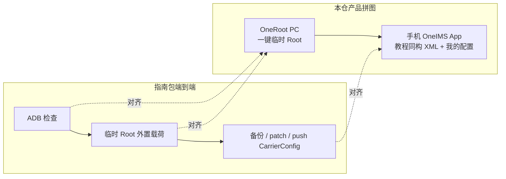

# OneRoot「重插线再一键」 vs CarrierConfig 指南包 · 逻辑一致性对照

日期：2026-08-05  
对照对象：

| 侧 | 路径 / 入口 |
|---|---|
| A · 重插线再一键 | `OneRoot/`（`oneso.cmd_temp_root` + Hub「一键临时 Root」；掉线恢复口令见 `docs/changes/2026-08-05-temproot-earlystop-postclean-race.md`） |
| B · 指南包 | `E:\Down\TEMP\android-temporary-root-carrierconfig-guide-redacted`（脱敏教程） |
| 参考 · 手机 App | `TempRootCarrierXmlPersist` / `CarrierConfigXmlMinimalPatcher`（注释写明「教程同构」） |

## 总裁决

**不一致（若把两边当成同一条端到端流水线）。**  
**分层部分一致（若只比「拿到临时 Root」这一层）。**

产品已把职责拆开：PC OneRoot **只做**临时 Root；运营商 XML **不做**，交给手机 App。指南包则是「临时 Root（外置载荷）+ CarrierConfig 维护」的完整教程。

## 同构图（指南端到端 ≈ OneRoot + App）



操作口令：ADB 掉线 / unauthorized / 一键失败 → **重插数据线 → 允许调试 → 再点一键**（OneRoot UI 已提示）。

## App ↔ 指南 XML 键差（核对结果）

| 键 | App `CarrierConfigXmlMinimalPatcher` | 指南 `patch-local-carrierconfig.ps1` | 模板 | 一致 |
|---|---|---|---|---|
| `carrier_volte_available_bool` | ✅ | ✅ `$networkBooleans` | minimal fragment | ✅ |
| `vonr_enabled_bool` | ✅ | ✅ | minimal | ✅ |
| `vonr_setting_visibility_bool` | ✅ | ✅ | minimal | ✅ |
| `show_4g_for_lte_data_icon_bool` | ✅ | ✅ | minimal | ✅ |
| `carrier_nr_availabilities_int_array` = `[1,2]` | ✅ | ✅ | minimal | ✅ |
| `carrier_name_override_bool` | 有显示名时 | `-EnableDisplayName` | display fragment | ✅ |
| `carrier_name_string` | 有显示名时 | 同上 | display | ✅ |
| `enable_carrier_display_name_resolver_bool` | 有显示名时 | 同上 | display | ✅ |
| `spn_display_condition_override_int=2` | 有显示名时 | 同上 | display | ✅ |

**键差 = 0，无需改 App 补丁逻辑。** 安装语义（只改已存在文件、`chown radio:radio`、`chmod 0600`、`restorecon`/`chcon`、可选 `killall com.android.phone`）App 与 `push-carrierconfig.ps1` 同构。

## 分层对照

| 层 | A · OneRoot 一键 | B · 指南包 | 裁决 |
|---|---|---|---|
| ADB 掉线恢复 | 「重插线后再点一键」（UI/体检文案已挂） | 重新插线 / `adb kill-server` / 再授权 | **意图一致** |
| 设备匹配 | `ro.product.device` + `ro.build.id` 解析 so | 先查 model/device/build/fingerprint，载荷须匹配 | **原则一致** |
| 拿临时 Root | 自动：push → kill stuck → `LD_PRELOAD` 多轮 → 双路径验 su → 成功后只杀挂起进程、重绑 Shizuku | 手工：push preload → `LD_PRELOAD` → `apex/.../su -c id`；**不附载荷** | **原理一致，编排不一致** |
| preload 远程路径 | `/data/local/tmp/preload-comet.so` | 示例 `/sdcard/Download/preload.so` | **路径不一致** |
| su 校验 | `/data/local/tmp/su` **优先**，再 `/apex/com.android.virt/bin/su` | 默认仅 apex su | **不完全一致** |
| CarrierConfig | Hub 明示「本窗不做运营商持久化」 | 主线：备份 → 本地 patch → push `-Apply` | **产品边界不一致** |
| 成功后副作用 | shell 重绑 Shizuku（禁 su 拉） | 无 Shizuku 步骤 | **OneRoot 独有** |

## 正确拼图

```text
指南包端到端 ≈ OneRoot「一键临时 Root」 + App「应用运营商与我的配置 / 教程同构 XML」
```

单独拿「重插线再一键」去对齐整本指南 → **会判不一致**（缺 Carrier 主线是设计如此，不是漏实现）。

## 本轮落地（前三项）

1. 同构图：本节 mermaid。  
2. 键差核对：上表 PASS，未改 App。  
3. OneRoot 重插线提示：`web/index.html` `.home-tip`、`web/app.js` 体检/失败文案、`hub.py` adb offline detail。

## 验证

- 静态对照：指南 README / scripts / templates；`OneRoot/oneso.py`、`hub.py`、`web/*`；App patcher + persist  
- 单测：`CarrierConfigXmlMinimalPatcherTest`（本轮执行见交付）  
- 真机闭环：用户自测（本轮 NOT RUN）
